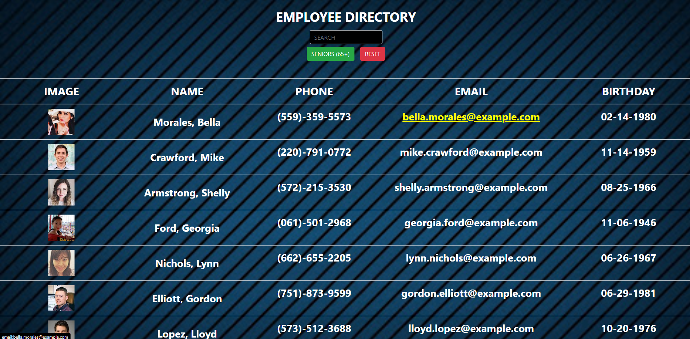

# Employee Directory REACT
  ## README created by: MrBusiness87
  ---
  

  ---
  ## Table of Contents:
  * [Title](#Title)
  * [Description](#Description)
  * [Installation](#Installation)
  * [Usage](#Usage)
  * [License](#License)
  * [Questions](#Questions)
  

  ---
  

  ### Title:
  Employee Directory REACT
  

  ### Description:
  Using a database that was provided as a website to display employees information in a legible and easy format. The application will also tell you which employees are Seniors (+65) and you can also search by employee names, there was a button added that will allow you to reset the list to its previous state.
  

  ### Installation:
  The dependencies needed: AXIOS BOOTSTRAP REACT REACT-BOOTSTRAP-TABLE REACT-DOM REACT-ROUTER-DOM REACT-SCRIPTS @TESTING-LIBRARY: &emsp;JEST-DOM &emsp;REACT &emsp;USER-EVENT   
  Download code from git hub repository then an "npm i" command in GitBash when you navigate inside the repository. 
  When You are ready to launch the application type "npm start" command in GitBash when you are inside the application part of the repository folder.
  

  ### Usage:
  Exactly as it is titled, it is an Employee Directory using the REACT application creator so that it only needed one page.

  ### License:
  License None:  When there is no license there is no copyright, except the one you create yourself.

  ---
  ### Questions:
  * GitHub Page: https://github.com/MrBusiness87
  * Please send an email to: bbartula87@gmail.com, with any Questions/Concerns/Comments!
  